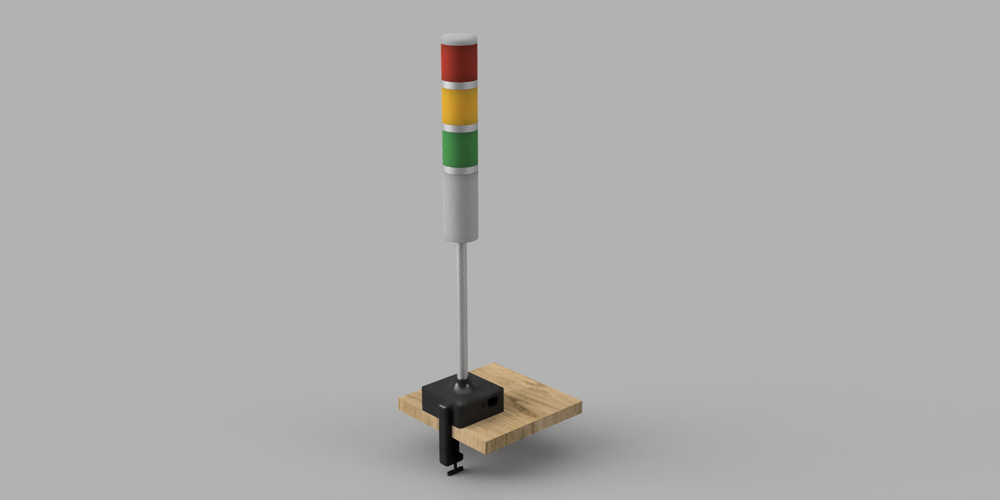
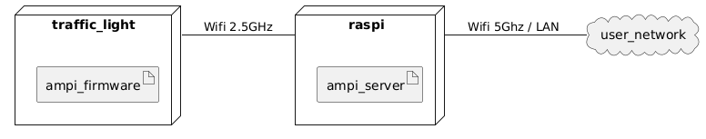

# AMPI

Enable your traffic light (<b>Amp</b>el) to be an <b>I</b>OT device. The traffic light is controlled by a esp controller which connects to your raspberry pi like access point.




## Server

The server is developed to run on a raspberry pi. This device is the bridge to your 5G wifi network of lan interface.

### Setup


As the project is intended to run on a raspberry pi, the setup steps only support this [device setup](./doc/SetupAP.md)

### Run

```
docker run --network host -e PORT=3000 vgerber/ampi-server:dev-arm
```

The container needs to run in host network to access the wifi access point data.

## Controller

The firmware is written for "ESP8266" MCUs

### Setup

#### Access Point

Configure the wifi access point at the top of the file. Dynamically setting the AP credentials is an open task

```
const char* ssid     = "";
const char* password = "";
```

#### Flashing

The firmware can be flashed with arduino IDE.

Required libraries are

- ArduinoJson
